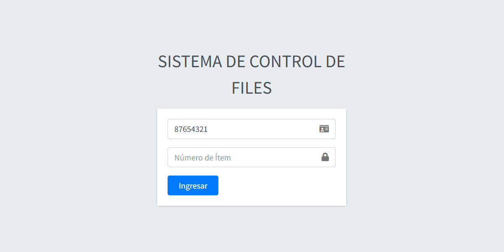

# 🏥FileOrderingSystem

  
  
  

## 📌 Index  
1. [Project Description](#-project-description)  
2. [Features](#-features)  
3. [Usage](#-usage)  
4. [Project Status](#-project-status)  
5. [Demonstration](#-demonstration)  
6. [Technologies Used](#-technologies-used)  
7. [Project Developers](#-project-developers)  
8. [Contributors](#-contributors)  

## 📖 Project Description  
This project was created as part of the mandatory internship for the **Computer Systems** program.  
A simple application for requesting warehouse files for review in different areas of the **"SEDES"** Departmental Health Service of Cochabamba, Bolivia.  
Users can log in, request files, and view their requests, while administrators can accept or reject these requests.  

## 🚀 Features  
✅ Request files.  
✅ View request history.  
✅ Accept or reject requests.  
✅ View accepted requests with time alerts.  

## 📜 Usage  
1. One or more files are requested in the file request section.  
2. The administrator will accept or reject the request in the pending requests section.  
3. If the request is accepted, a warehouse manager will deliver the requested files to the corresponding department and person.  
4. Once the file review is complete, the files must be returned to the warehouse.  
5. Upon return, a warehouse manager will verify that everything is in order.  
6. As the final step, the manager will mark the request as returned in the request history section.  

## 🚀 Project Status  
🟡 In development - Planned improvements include implementing statistics to track how often a user requests files, their average usage time, and identifying the departments and sub-departments that request these files the most.  

## 🎥 Demonstration  
Here you can see how the system works:  

  

## 🛠️ Technologies Used  
- HTML  
- CSS  
- JavaScript  
- PHP  
- Bootstrap  
- MySQL  

## 👨‍💻 Project Developers  
- **Paolo Pizarro A.** - [GitHub](https://github.com/GalletitaDeAnis)  

## 👨‍💻 Contributors  
- [ColorlibHQ](https://github.com/ColorlibHQ)
